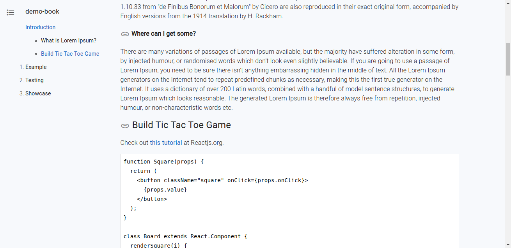

## Master Class Builders Platform (MCBP)

Open source web app to self-publish and sell books or other online content. 
A fully comprehensive web app for publishing and monetizing your books and other online content.

## How can you use this app?
- To sell online content, such as books.
- To write and host free documentation with Github being a source of truth for content <br> 
- As an online educational platform to share or teach stuff <br>
- As a comprehensive and secure web app, it could be adapted to personal websites, blogs or to take payment online.  

## Contents
- [About](#About)
- [More Features in the App](#More-Features-in-the-app)
- [Screenshots](#Screenshots)
- [Built with](#Built-with)
     - [Core stack](#core-stack)
     - [Third party APIs](#third-party-apis)
- [Run locally](#Run-locally)
- [Add a new book/content](#Add-a-new-book/content)
- [Add your own styles](#Add-your-own-styles)
- [Author](#Author) 
- [Contributing](#Contributing)
- [License](#License)
- [Project structure](#project-structure)

## About 
Check all features this open-source could offer:

Please Note - this web app is built/designed with MERN(MongoDB, Express, React, and Node.js), backed using headless CMS - Github and Stripe for taking payment. It is a universal app that renders using both SSR and CSR. 

User roles, access, and pages are separated into admins, customers, and public

### as an admin(s):
     - adding many Books/online contents/classrooms (setting the name, price, content, book)

     - editing many Books/online contents/classrooms (setting the name, price, content, book)

     - Give access for free or when content is purchased and revoke access as fit

     - synchronize the contents in books/chapter using ( a single click ), 
       it uses integrated Github API the API fetches all changes(commits) 
       on GitHub and merges/creates corresponding values in the Mongo DB 
       that would populate the website

     - take payments with stripe

     - others are: monitor the site traffic with integrated Google analytics,
       communicate with customers using Mailchimp and AWS SES, 
       and get contents easily crawl by search engine bots with a systematic update.

     - Adjust several internal APIs if needed

     - Add different styles and modules

### for customers: 
      As a customer that bought the books/contents or given free access enjoy

     - seamless access/signup using Google account - no registration needed

     - effortless payment using stripe

     - Mobile support

     - Web Accessibility

     - curated site contents and site architecture made with readers in mind 
       (e.g disappearing Header after scrolling down a bit, hidden table of content,
       highlighted current section on the open table of content as 
       user scroll down the main content, etc.) 
     
  ### for Public: 
      As potential customers or users

     - they get to see and read the free contents

     - purchase the books/contents and signup with **a single click**    


## More Features in the App
 - app sends an email to a user using AWS SES immediately after signup/purchase
  - live Scroll update on the Table of content
  - Mobile support
  - Several Internal APIs(they could be adjusted as developer wishes)
  - Thorough modularity and organization
  - comprehensive app security implemented using standard recommendation (Helmet, express-session, compression, and other middlewares). 
  - Pages that render on the server for the first time and renders on the 
  client for others using Next/Link and getInitialProps/componentDidMount
   to fetch data (SSR and CSR)
  - consistent layout and Next.js/Material-UI integration
  - persistent session that lasts for 14 days
  - several checks to prevent unauthorized access
  - unit and integration test done
  - NProgress to show the state of a request as the app loads
  - app uses users google account avatar in the header
  - easily adjusted to add more features
  - Informational success/error messages - notifier that displays when an action is taken
  - use async logger with Winston logger
  - SEO friendly features included
  - many more - find out by checking the app by running it locally

check it out  here: https://mcbp.herokuapp.com/books/demo-book/introduction

## Screenshots
Chapter excerpt with Buy Button for Public/Guest visitor:<br><br>
<br><br>

Chapter content and Table of Contents for book Customer:<br><br>
<br><br>

Add-book/Edit-book page for Admin user:<br><br>
<br><br>

Login page for Public/Guest visitor:<br><br>
<br><br>

Book-detail page for Admin user:<br><br>
<br><br>

Mobile chapter page for customer user:<br><br>
<br><br>

## Built with

#### Core stack
- [React](https://github.com/facebook/react)
- [Material-UI](https://github.com/mui-org/material-ui)
- [Next](https://github.com/zeit/next.js)
- [Express](https://github.com/expressjs/express)
- [Mongoose](https://github.com/Automattic/mongoose)
- [MongoDB](https://github.com/mongodb/mongo)

#### Third-party APIs
- Google OAuth
- Github
- AWS SES
- Stripe
- MailChimp

Check out [package.json](package.json).

## Run locally
- Clone the project and run `yarn` to add packages.
- Before you start the app, create a `.env` file at the app's root. This file must have values for some env variables specified below.
  - To get `MONGO_URL_TEST`, we recommend a [free MongoDB at MongoDB Atlas](https://docs.mongodb.com/manual/tutorial/atlas-free-tier-setup/) (to be updated soon with MongoDB Atlas, see [issue](https://github.com/async-labs/builderbook/issues/138)).
  - Get `GOOGLE_CLIENTID` and `GOOGLE_CLIENTSECRET` by following [official OAuth tutorial](https://developers.google.com/identity/sign-in/web/sign-in#before_you_begin).

    Important: For Google OAuth app, callback URL is: http://localhost:8000/oauth2callback <br/>
    Important: You have to enable Google+ API in your Google Cloud Platform account.

  - Specify your secret key and name for Express session `SESSION_SECRET` and `SESSION_NAME` : https://github.com/expressjs/session#secret


- To use all features and third-party integrations (such as Stripe, Google OAuth, Mailchimp), add values for all of the following env variables in your `.env` file:

  `.env` :
  ```
  # Used in server/app.js
  MONGO_URL=
  MONGO_URL_TEST=
  SESSION_NAME=
  SESSION_SECRET=

  # Used in lib/api/getRootUrl.js
  URL_APP=
  PRODUCTION_URL_APP=

  # Used in server/google.js
  Google_clientID=
  Google_clientSecret=

  # Used in server/aws.js
  AWS_ACCESSKEYID=
  AWS_SECRETACCESSKEY=
  AWS_REGION=

  # Used in server/models/User.js
  EMAIL_ADDRESS_FROM=
  
  ----------
  # All environmental variables above this line are required for successful signup
  
  # Used in server/github.js
  GITHUB_TEST_CLIENTID=
  GITHUB_LIVE_CLIENTID=
  GITHUB_TEST_SECRETKEY=
  GITHUB_LIVE_SECRETKEY=

  # Used in server/stripe.js
  STRIPE_TEST_PUBLISHABLEKEY=
  STRIPE_LIVE_PUBLISHABLEKEY=
  STRIPE_TEST_SECRETKEY=
  STRIPE_LIVE_SECRETKEY=
  STRIPE_TEST_DEMO_BOOK_PRICE_ID=
  STRIPE_LIVE_DEMO_BOOK_PRICE_ID=
  STRIPE_TEST_SECOND_BOOK_PRICE_ID=
  STRIPE_LIVE_SECOND_BOOK_PRICE_ID=

  # Used in server/mailchimp.js
  MAILCHIMP_API_KEY=
  MAILCHIMP_REGION=
  MAILCHIMP_PURCHASED_LIST_ID=
  MAILCHIMP_SIGNEDUP_LIST_ID=

  # Used in pages/_document.js and pages/_app.js
  GA_MEASUREMENT_ID=
  COOKIE_DOMAIN=

  ```

- Start the app with `yarn dev`.
  - To get `GA_MEASUREMENT_ID`, set up Google Analytics and follow [these instructions](https://support.google.com/analytics/answer/1008080?hl=en) to find your tracking ID.
  - To get Stripe-related API keys, set up or log in to your Stripe account and find your key [here](https://dashboard.stripe.com/account/apikeys).
- Env keys `GA_MEASUREMENT_ID`, `URL_APP`, `PRODUCTION_URL_APP` and `STRIPE_TEST_PUBLISHABLEKEY`/`STRIPE_LIVE_PUBLISHABLEKEY` are universally available (client and server). Env keys inside the `.env` file are used in server code only. To make env vars universally available, add them to the `next.config.js` file.
- To make a user a book's owner, set `"isAdmin": true` on the corresponding MongoDB document in your database (default value is `false` for any new user).

**Important: if you don't add values for environmental variables to the `.env` file, the corresponding functionality will not work. For example, login with Google account, purchasing book, getting repo information via GitHub API and other third-party API infrastructures.**

**Important: in the development environment, make sure the GitHub repo name is `demo-book` or `second-book` or have both repos available in your public/private Github, <br> in case you what to `change the name` or in `production` environment, make the changes; and also make sure it matches `pricing name` on the `stripe site dashboard` and `bookSlug` names inside `server/strip.js` inside `getBookPriceId` function for the application to work. <br> change the corresponding environmental variable names (`demo-book` or `second-book`) as well**


## Add a new book/content
- Create a new Github repo (public or private).
- In that repo, create an `introduction.md` file and write some content.
- At the top of your `introduction.md` file, add metadata in the format shown below. See [this file](https://github.com/olumide025/demo-book/blob/master/introduction.md) as an example.
  
  ```
  ---
  title: Introduction
  seoTitle: title for search engines
  seoDescription: description for search engines
  isFree: true
  ---
  ```

- Go to the app, click "Connect Github".
- Click "Add Book". Enter details and select the Github repo you created.
- Click "Save".

When you add new `.md` files or update content, go to the `BookDetail` page of your app and click `Sync with Github`. 

Important: All `.md` files in your Github repo _must_ have metadata in the format shown above.

Important: All `.md` files in your Github repo _must_ have name `introduction.md` or `chapter-N.md`.

To make the content of a `.md` file _private_ (meaning a person must purchase the content to see it), remove `isFree:true`  and add `excerpt:""`. Add some excerpt content - this content is public and serves as a free preview.


## Add your styles
To change the color scheme of this app, modify the `primary` and `secondary` theme colors inside `lib/context.js`. Select any colors from Material UI's official [color palette](https://material-ui-next.com/style/color/#color).

Recommended ways to add your own styles to this app:
1. [Inline style for a single element](#inline-style-for-a-single-element)
2. [Reusable style for multiple elements within single page or component](#reusable-style-for-multiple-elements-within-single-page-or-component)
3. [Reusable/importable style for multiple pages or components](#reusableimportable-style-for-multiple-pages-or-components)
4. [Global style for all pages in application](#global-style-for-all-pages-in-application)


### Inline style for a single element
USE CASE: apply a style to _one element_ on a single page/component <br>

```
<p style={{ textAlign: 'center' }}>
  ...
</p>
```

### Reusable style for multiple elements within a single page or component
USE CASE: apply the same style to _multiple elements_ on a single page/component.

```
const styleExcerpt = {
  margin: '0px 20px',
  opacity: '0.75',
  fontSize: '13px',
};

<p style={styleExcerpt}>
  ...
</p>

```

### Reusable/importable style for multiple pages or components
USE CASE: apply the same style to elements on _multiple pages/components_.<br>
For example, we created `styleLoginButton` inside `components/SharedStyles.js` and exported the style at the bottom of the file:
```
const styleLoginButton = {
  borderRadius: '2px',
  textTransform: 'none',
  font: '16px',
  fontWeight: '400',
  letterSpacing: '0.01em',
  color: 'white',
  backgroundColor: '#DF4930',
};

module.exports = {
  styleLoginButton,
};
```
[See usage](components/SharedStyles.js#L17)

We then imported `styleLoginButton` into our `login` page, and applied the style to a `<Button>` element:
```
import { 
  styleLoginButton 
  } from '../../components/SharedStyles';


<Button
        variant="contained"
        style={styleLoginButton}
        href={`/auth/google?redirectUrl=${redirectUrl}`}
      >
  ...
</Button>
```
[See usage](pages/public/login.js#L31)


### Global style for all pages in the application
USE CASE: apply the same style to elements on _all pages_ of your app.<br>
Create your style in `pages/_document.js`. For example, I specified a style for all hyperlinks that use the `<a>` element:
```
<style>
  {`
    a, a:focus {
      font-weight: 400;
      color: #1565C0;
      text-decoration: none;
      outline: none
    }
  `}
</style>
```
[See usage](pages/_document.js#L51)

We also specified styles for all content inside a `<body>` element:
```
<body
    style={{
      font: '16px Roboto',
      color: '#222',
      margin: '0px auto',
      fontWeight: '300',
      lineHeight: '1.5em',
      backgroundColor: '#F7F9FC',
      minHeight: '100%',
    }}
  >
  .......
</body>
```
[See usage](./pages/_document.js#L100)

## Author
Abeeb Ridwan Olumide (MCBP)

## Contributing
Pull requests are welcome. For major changes, please open an issue first to
discuss what you would like to change.

Please make sure to test as appropriate.

## License
[MIT](LICENSE.md)


## Project structure

```
.
├── components                          # React components
│   ├── admin                           # Components used on Admin pages
│   │   ├── EditBook.jsx                # Edit title, price, and repo of book
│   ├── customer                        # Components used on Customer pages
│   │   ├── BuyButton.jsx               # Buy book
│   ├── Header.js                       # Header component
│   ├── MenuDrop.js                     # Dropdown menu
│   ├── Notifier.js                     # In-app notifications for app's users
│   ├── SharedStyles.js                 # Shared CSS styles imported to the pages
├── images                              # images used for description in the Readme file
│   ├── Add&Edit page.png               # Add&Edit Page screenshot
│   ├── ChapterPage.png                 # Chapter page screenshot
│   ├── DetailPage.png                  # Detail Page screenshot
│   ├── ChapterToc.png                  # chapter page with a table of content screenshot
│   ├── LoginPage.png                   # Login Page screenshot
│   ├── Mobile.png                      # mobile Page screenshot
├── lib                                 # Code available on both client and server
│   ├── api                             # Client-side API methods
│   │   ├── admin.js                    # Admin user methods
│   │   ├── customer.js	                # Customer user methods
│   │   ├── getRootURL.js               # Returns ROOT_URL
│   │   ├── public.js                   # Public user methods
│   │   ├── sendRequest.js              # Reusable code for all GET and POST requests
│   ├── notifier.js                     # Contains notify() function that loads Notifier component
│   ├── theme.js                        # HOC for SSR with Material-UI and more
│   ├── withAuth.js                     # HOC that passes the user to pages and more
├── pages                               # Pages
│   ├── admin                           # Admin pages
│   │   ├── add-book.jsx                # Page to add a new book
│   │   ├── book-detail.jsx             # Page to view book details and sync content with Github
│   │   ├── edit-book.jsx               # Page to update the title, price, and repo of the book
│   │   ├── index.jsx                   # Main Admin page that has all books and more
│   ├── customer                        # Customer pages
│   │   ├── my-books.js                 # Customer's dashboard
│   ├── public                          # Public pages (accessible to logged out users)
│   │   ├── login.js                    # Login page
│   │   ├── read-chapter.js             # Page with chapter's content
│   ├── _app.js                         # HOC extension allows to customize pages
│   ├── _document.js                    # Allows customizing pages (a feature of Next.js)
│   ├── book.js                         # Book page
│   ├── index.js                        # Homepage
├── Public                              # Static resources
│   ├── robots.txt                      # Rules for search engine bots
├── server                              # Server code
│   ├── api                             # Express routes, route-level middleware
│   │   ├── admin.js                    # Admin routes
│   │   ├── customer.js                 # Customer routes
│   │   ├── index.js                    # Mounts all Express routes on the server
│   │   ├── public.js                   # Public routes
│   ├── models                          # Mongoose models
│   │   ├── Book.js                     # Book model
│   │   ├── Chapter.js	                # Chapter model
│   │   ├── EmailTemplate.js            # Email Template model
│   │   ├── Purchase.js                 # Purchase model
│   │   ├── User.js                     # User model
│   ├── utils                           # Server-side util
│   │   ├──slugify.js                   # Generates slug for any Model
│   ├── app.js                          # Custom Express/Next server
│   ├── aws.js                          # AWS SES API
│   ├── github.js                       # Github API
│   ├── google.js                       # Google OAuth API
│   ├── logger.js                       # Logger
│   ├── mailchimp.js                    # MailChimp API
│   ├── routesWithSlug.js               # Handles Express routes that contain a slug
│   ├── sitemapAndRobots.js             # Express routes for sitemap.xml and robots.txt
│   ├── stripe.js                       # Stripe API
├── test/server/utils                   # Tests
│   ├── slugify.test.js                 # Unit test for generateSlug() function
├── .eslintrc.js                        # Config for Eslint
├── .gitignore                          # List of ignored files and directories
├── LICENSE.md                          # MIT License
├── next.config.js                      # Passes environmental variable to the client
├── package.json                        # List of packages and scripts
├── README.md                           # Instructions about the app
├── yarn.lock                           # Exact versions of packages. Generated by yarn.

```
